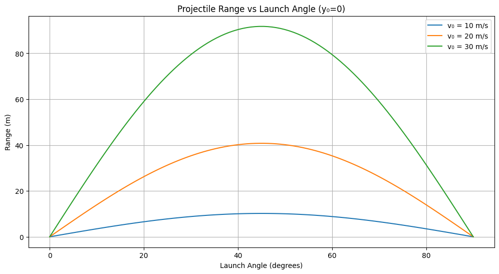
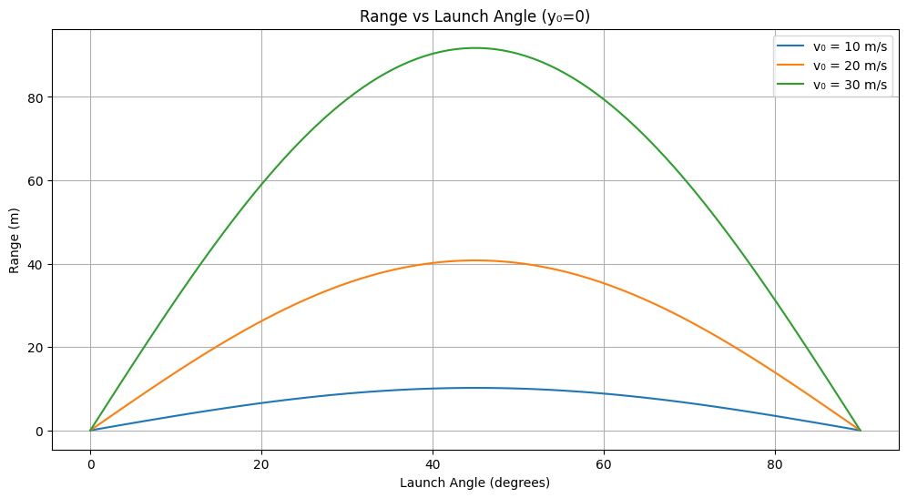
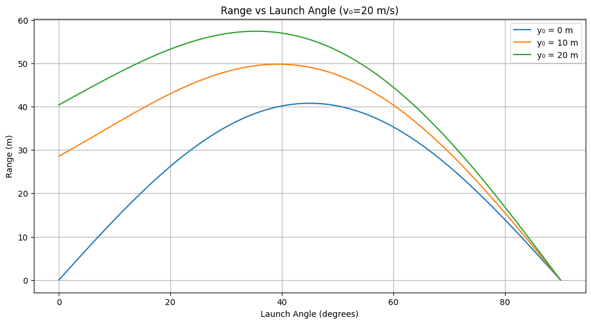

---

### **Mathematical Formulation of Projectile Motion**

#### **1.1 Governing Equations of Motion**

Based on **Newton’s Second Law**, and assuming no air resistance:

$$ F = ma = -mg\hat{y} $$

This leads to two differential equations:

* **Horizontal:**

  $$ \frac{d^2x}{dt^2} = 0 $$
  
  

* **Vertical:**

  $$  \frac{d^2y}{dt^2} = -g   $$

  
  

#### **2. Solving the Equations**

Initial conditions:

* Position: $(x_0, y_0) = (0, y_0)$
* Velocity: $v_0$ at angle $\theta$
* Components:

  $$
  v_{0x} = v_0 \cos\theta, \quad v_{0y} = v_0 \sin\theta
  $$

Solutions:

$$
x(t) = v_0 \cos\theta \cdot t
$$

$$
y(t) = y_0 + v_0 \sin\theta \cdot t - \frac{1}{2} g t^2
$$

#### **3. Time of Flight**

To find when the projectile hits the ground $y(t) = 0$:

* If $y_0 = 0$:

$$
t = \frac{2 v_0 \sin\theta}{g}
$$

* If $y_0 \neq 0$:

$$
t = \frac{v_0 \sin\theta + \sqrt{(v_0 \sin\theta)^2 + 2g y_0}}{g}
$$

#### **4. Range Calculation**

* $y_0 = 0$:

$$
R = \frac{v_0^2 \sin 2\theta}{g}
$$

* $y_0 \neq 0$:

$$
R = v_0 \cos\theta \cdot t
$$

Where $t$ is the total time of flight.

#### **5. Maximum Height**

* $y_0 = 0$:

$$
H = \frac{v_0^2 \sin^2\theta}{2g}
$$

* $y_0 \neq 0$:

$$
H = y_0 + \frac{v_0^2 \sin^2\theta}{2g}
$$

#### **6. Optimal Launch Angle**

* For maximum range (when $y_0 = 0$):

$$
\theta_{\text{optimal}} = 45^\circ
$$

* For $y_0 > 0$:

$$
\theta_{\text{optimal}} \approx 45^\circ - \frac{y_0}{v_0^2} \cdot k
$$

---

---

### **1.2 Range vs. Launch Angle**

$$
R = \frac{v_0^2 \sin 2\theta}{g}
$$

**Key Insights:**

1. **Launch Angle:**

   * Max range at $\theta = 45^\circ$
   * Symmetry: $R(\theta) = R(90^\circ - \theta)$

2. **Initial Velocity:**

   * $R \propto v_0^2$

3. **Gravity:**

   * $R \propto \frac{1}{g}$

4. **Initial Height $y_0$:**

$$
t = \frac{v_0 \sin\theta + \sqrt{(v_0 \sin\theta)^2 + 2gy_0}}{g}
$$

$$
R = v_0 \cos\theta \cdot t
$$

---

---

### **3. Observations from Graphs**

1. **Increasing $v_0$** raises both peak and range.
2. **Higher $y_0$** shifts optimal angle below $45^\circ$.

---

### **4. Limitations & Extensions**

**Limitations:**

* No air resistance
* No wind
* Flat terrain

**Possible Extensions:**

* **Drag force:**

  $$
  F_{\text{drag}} = \frac{1}{2} C_d \rho A v^2
  $$
* **Wind effects**
* **Numerical models**

---

### **5. Conclusion**

* Max range at $45^\circ$
* Higher $v_0$ → longer range
* Higher $y_0$ → optimal angle < $45^\circ$
* Lower gravity → longer range

---

### **1.3 Angle vs. Range Analysis**

Projectile motion is governed by:

$$
F = ma
$$

**Equations of Motion:**

* Horizontal:

  $$
  x(t) = v_0 \cos\theta \cdot t
  $$
* Vertical:

  $$
  y(t) = y_0 + v_0 \sin\theta \cdot t - \frac{1}{2} g t^2
  $$

**Time of Flight (if $y_0 = 0$):**

$$
t = \frac{2 v_0 \sin\theta}{g}
$$

**Range:**

$$
R = \frac{v_0^2 \sin 2\theta}{g}
$$

If $y_0 \neq 0$:

$$
t = \frac{v_0 \sin\theta + \sqrt{(v_0 \sin\theta)^2 + 2 g y_0}}{g}
$$

$$
R = v_0 \cos\theta \cdot t
$$

---

---

### **Applications**

1. **Sports:** Optimal shots in basketball, soccer, golf.
2. **Military:** Artillery, missiles.
3. **Aerospace:** Planetary landing, satellite launches.

---

### **Limitations & Further Work**

**Limits:**

* No drag
* No wind
* Level ground

**Future Improvements:**

* Include air resistance:

  $$
  F_{\text{drag}} = \frac{1}{2} C_d \rho A v^2
  $$
* Simulate wind effects
* Use numerical methods

---

---

