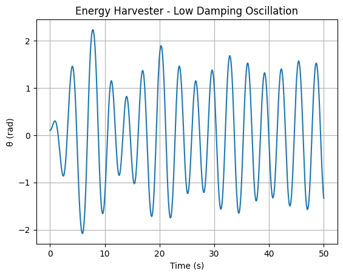
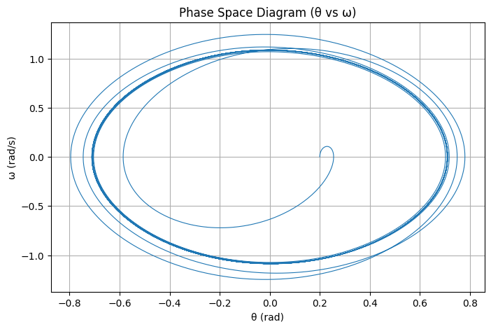
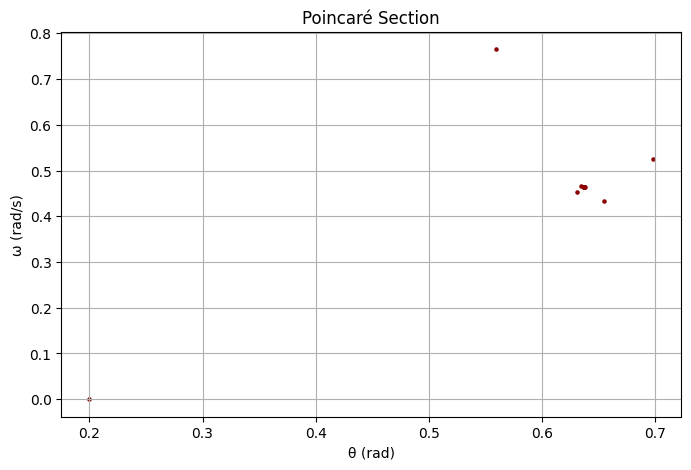

---

## **Problem 2: Forced Damped Pendulum**

### **1.1 Theoretical Foundation**

#### ✅ Differential Equation:

The motion of a forced damped pendulum is governed by:

$$
\frac{d^2\theta}{dt^2} + \beta \frac{d\theta}{dt} + \omega_0^2 \sin(\theta) = A \cos(\omega t)
$$

For **small angles** $\theta \approx \sin(\theta)$, it simplifies to:

$$
\frac{d^2\theta}{dt^2} + \beta \frac{d\theta}{dt} + \omega_0^2 \theta = A \cos(\omega t)
$$

---

---

### **2.1.2 Analysis of Dynamics**

This is the **nonlinear form** of the differential equation (no approximation):

$$
\frac{d^2\theta}{dt^2} + \beta \frac{d\theta}{dt} + \omega_0^2 \sin(\theta) = A \cos(\omega t)
$$

Used to study **chaotic motion** and **resonance behavior** in the full system.

---

---

### **2.1.3 Practical Applications**

Simulations of real-world systems (e.g., mechanical oscillators) can be modeled using the **same equation**:

$$
\frac{d^2\theta}{dt^2} + \beta \frac{d\theta}{dt} + \omega_0^2 \sin(\theta) = A \cos(\omega t)
$$

Parameters (β, ω₀, A, ω) are varied to reflect different scenarios.

---

---

### **2.1.4 Phase Portrait & Poincaré Section**

We analyze system dynamics using:

* **Phase Portraits:** $\theta$ vs. $\dot{\theta}$
* **Poincaré Sections:** sampled state at regular intervals

Governing equation (nonlinear form) again:

$$
\frac{d^2\theta}{dt^2} + \beta \frac{d\theta}{dt} + \omega_0^2 \sin(\theta) = A \cos(\omega t)
$$

---

---

