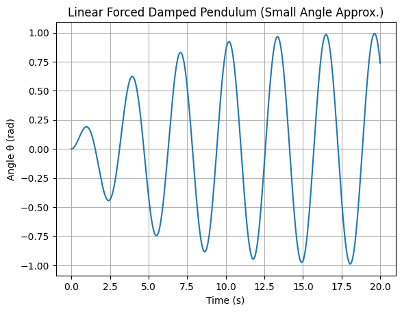
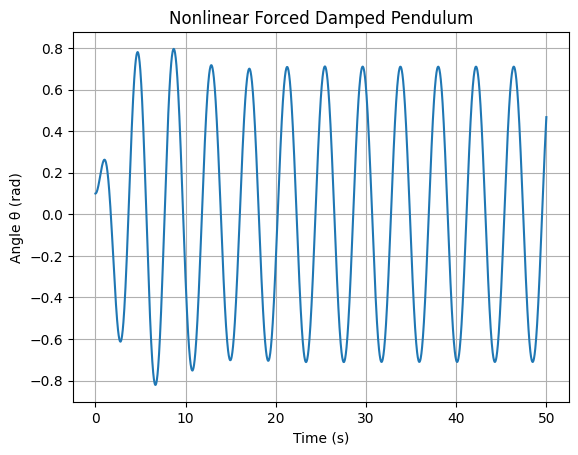

# Problem 2

1.1
 Task 1: Theoretical Foundation
🔹 Differential Equation (Forced Damped Pendulum):
𝑑
2
𝜃
𝑑
𝑡
2
+
𝛽
𝑑
𝜃
𝑑
𝑡
+
𝜔
0
2
sin
⁡
(
𝜃
)
=
𝐴
cos
⁡
(
𝜔
𝑡
)
dt 
2
 
d 
2
 θ
​
 +β 
dt
dθ
​
 +ω 
0
2
​
 sin(θ)=Acos(ωt)
For small angles:

sin
⁡
(
𝜃
)
≈
𝜃
⇒
𝑑
2
𝜃
𝑑
𝑡
2
+
𝛽
𝑑
𝜃
𝑑
𝑡
+
𝜔
0
2
𝜃
=
𝐴
cos
⁡
(
𝜔
𝑡
)
sin(θ)≈θ⇒ 
dt 
2
 
d 
2
 θ
​
 +β 
dt
dθ
​
 +ω 
0
2
​
 θ=Acos(ωt)

2.1.2
2.1.2

✅ Task 2: Analysis of Dynamics
🔹 Nonlinear Differential Equation:
𝑑
2
𝜃
𝑑
𝑡
2
+
𝛽
𝑑
𝜃
𝑑
𝑡
+
𝜔
0
2
sin
⁡
(
𝜃
)
=
𝐴
cos
⁡
(
𝜔
𝑡
)
dt 
2
 
d 
2
 θ
​
 +β 
dt
dθ
​
 +ω 
0
2
​
 sin(θ)=Acos(ωt)
This is the full nonlinear form (no small-angle approximation).

