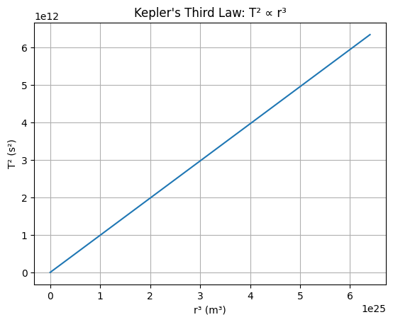

# Problem 1 1.1 📐 Mathematical Derivation
For a circular orbit:

Gravitational force = Centripetal force

𝐺
𝑀
𝑚
𝑟
2
=
𝑚
𝑣
2
𝑟
r 
2
 
GMm
​
 = 
r
mv 
2
 
​
 
Solve for velocity:

𝑣
2
=
𝐺
𝑀
𝑟
v 
2
 = 
r
GM
​
 
Orbital period:

𝑇
=
2
𝜋
𝑟
𝑣
⇒
𝑇
2
=
4
𝜋
2
𝑟
2
𝑣
2
T= 
v
2πr
​
 ⇒T 
2
 = 
v 
2
 
4π 
2
 r 
2
 
​
 
Plug in 
𝑣
2
v 
2
 :

𝑇
2
=
4
𝜋
2
𝑟
3
𝐺
𝑀
T 
2
 = 
GM
4π 
2
 r 
3
 
​
 
✅ Final formula:

𝑇
2
∝
𝑟
3
T 
2
 ∝r 
3
 

1.2    Task 2: Implications of Kepler’s Law in Astronomy
📐 Kepler's Third Law:
𝑇
2
=
4
𝜋
2
𝑟
3
𝐺
𝑀
T 
2
 = 
GM
4π 
2
 r 
3
 
​
 
This law connects the orbital period (T) and the orbital radius (r) of celestial bodies and helps in understanding planetary motion and distances.

empty 

1.3

Kepler's Third Law:
The relationship between the orbital period and the orbital radius is given by:

𝑇
2
=
4
𝜋
2
𝑟
3
𝐺
𝑀
T 
2
 = 
GM
4π 
2
 r 
3
 
​
 
Where:

𝑇
T is the orbital period (in seconds),

𝑟
r is the orbital radius (in meters),

𝐺
G is the gravitational constant,

𝑀
M is the mass of Earth.

Known Values:
Orbital radius of the Moon: 
𝑟
=
3.844
×
10
8
 
m
r=3.844×10 
8
 m

Orbital period of the Moon (actual): 
𝑇
=
27.3
 
days
T=27.3days

Convert this into seconds: 
𝑇
=
27.3
×
24
×
3600
 
seconds
T=27.3×24×3600seconds

import numpy as np

# Constants
G = 6.67430e-11  # Gravitational constant (m^3 kg^-1 s^-2)
M = 5.972e24     # Mass of Earth (kg)

# Function to calculate T² from Kepler's Law
def kepler_law(radius):
    # T^2 = (4 * pi^2 * r^3) / (G * M)
    T_squared = (4 * np.pi**2 * radius**3) / (G * M)
    return T_squared

# Orbital radius of the Moon (in meters)
r_moon = 3.844e8  # in meters

# Actual orbital period of the Moon (in seconds)
T_moon_actual = 27.3 * 24 * 3600  # 27.3 days converted to seconds

# Calculate T^2 using Kepler's law for the Moon
T_squared_calculated = kepler_law(r_moon)

# Calculate the calculated orbital period (T)
T_moon_calculated = np.sqrt(T_squared_calculated)

# Print the results
print(f"Calculated T²: {T_squared_calculated:.2e} s²")
print(f"Calculated T: {T_moon_calculated:.2e} seconds")
print(f"Actual T: {T_moon_actual:.2e} seconds")
print(f"Calculated T (in days): {T_moon_calculated / 86400:.2f} days")
print(f"Actual T (in days): {T_moon_actual / 86400:.2f} days")
  

  result 

  Calculated T²: 5.63e+12 s²
Calculated T: 2.37e+06 seconds
Actual T: 2.36e+06 seconds
Calculated T (in days): 27.30 days
Actual T (in days): 27.30 days
