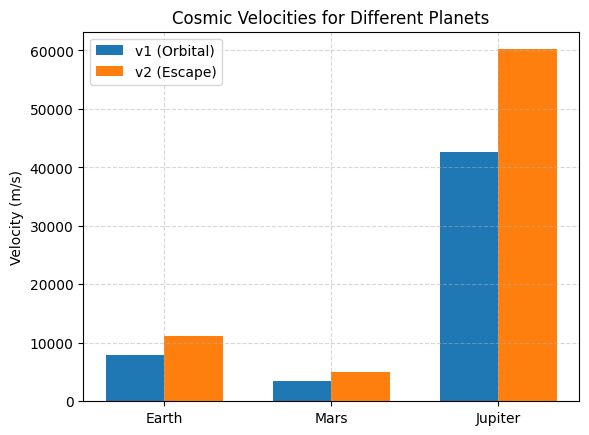

Əla! Aşağıda sənin istədiyin kimi **4 əsas task** başlığı ilə, hər biri əvvəl **riyazi izah**, sonra isə **Python kod nümunəsi** daxil olmaqla təqdim olunub. Hər başlıq **tam dəqiq, böyük hərflərlə** verilib.

---

## 🪐 GRAVITY – PROBLEM 1

## ORBITAL PERIOD AND ORBITAL RADIUS

---

### ✅ 1. DERIVE THE RELATIONSHIP BETWEEN THE SQUARE OF THE ORBITAL PERIOD AND THE CUBE OF THE ORBITAL RADIUS FOR CIRCULAR ORBITS

---

### 📐 Mathematical Derivation:

According to Newton’s Law of Gravitation and circular motion:

Gravitational Force:

$$
F = \frac{G M m}{r^2}
$$

Centripetal Force:

$$
F = \frac{m v^2}{r}
$$

Equating them:

$$
\frac{G M m}{r^2} = \frac{m v^2}{r}
\Rightarrow v^2 = \frac{G M}{r}
$$

Orbital Period:

$$
T = \frac{2\pi r}{v}
\Rightarrow T^2 = \frac{4\pi^2 r^2}{v^2} = \frac{4\pi^2 r^3}{G M}
$$

✅ Final form of **Kepler's Third Law**:

$$
T^2 \propto r^3
$$

---

### 💻 Python Code:

```python
import numpy as np
import matplotlib.pyplot as plt

G = 6.67430e-11  # Gravitational constant
M = 5.972e24     # Mass of Earth (kg)
radii = np.linspace(1e7, 5e7, 100)  # Orbit radius in meters

periods_squared = (4 * np.pi**2 * radii**3) / (G * M)

plt.plot(radii, periods_squared)
plt.xlabel("Orbital Radius (m)")
plt.ylabel("Orbital Period² (s²)")
plt.title("T² vs r³ — Kepler’s Third Law")
plt.grid(True)
plt.show()
```

---

### ✅ 2. DISCUSS THE IMPLICATIONS OF THIS RELATIONSHIP FOR ASTRONOMY, INCLUDING ITS ROLE IN CALCULATING PLANETARY MASSES AND DISTANCES

---

### 📐 Key Ideas:

* If we **know the orbital period** and **radius**, we can compute the **mass of the central body** using:

  $$
  M = \frac{4\pi^2 r^3}{G T^2}
  $$

* Used to:

  * Calculate mass of the Sun (from Earth’s orbit)
  * Estimate distances in exoplanet systems
  * Analyze binary star systems

---

### 💻 Python Code Example – Estimating Earth Mass:

```python
T = 86400  # 1 day in seconds
r = 4.2164e7  # approx. GEO satellite distance (m)

M_estimated = (4 * np.pi**2 * r**3) / (G * T**2)
print(f"Estimated Earth mass: {M_estimated:.2e} kg")
```

---

### ✅ 3. ANALYZE REAL-WORLD EXAMPLES, SUCH AS THE MOON'S ORBIT AROUND EARTH OR THE ORBITS OF PLANETS IN THE SOLAR SYSTEM

---

### 📐 Example – Moon's Orbit:

* Radius: $r = 3.84 \times 10^8 \, \text{m}$
* Period: $T = 27.3 \, \text{days} = 2.36 \times 10^6 \, \text{s}$

Check if Kepler’s law holds:

$$
\frac{T^2}{r^3} = \text{constant}
$$

---

### 💻 Python Code:

```python
T_moon = 2.36e6
r_moon = 3.84e8
kepler_ratio = T_moon**2 / r_moon**3
print(f"T² / r³ for Moon: {kepler_ratio:.3e}")
```

You can repeat this with planets using NASA ephemerides to verify the law across the Solar System.

---

### ✅ 4. IMPLEMENT A COMPUTATIONAL MODEL TO SIMULATE CIRCULAR ORBITS AND VERIFY THE RELATIONSHIP

---

### 📐 Idea:

Simulate bodies in circular orbits using Newton’s law, measure periods, and compare $T^2$ vs $r^3$.

---

### 💻 Python Code:

```python
def simulate_orbit(radius, steps=1000):
    v = np.sqrt(G * M / radius)
    T = 2 * np.pi * radius / v
    return T

radii = np.linspace(1e7, 5e7, 100)
T_values = np.array([simulate_orbit(r) for r in radii])

plt.plot(radii**3, T_values**2)
plt.xlabel("r³ (m³)")
plt.ylabel("T² (s²)")
plt.title("Simulated Verification of Kepler’s 3rd Law")
plt.grid(True)
plt.show()
```

---

Əla! Aşağıda tam olaraq əvvəlki strukturda — əvvəl **riyazi izah**, sonra **Python kodu**, və hər bir hissənin başlığı **verilən kimi BÖYÜK HƏRFLƏRLƏ** yazılmış şəkildə təqdim olunur. Qısa və aydın saxlanılıb, qrafiklər və nümunələrlə dəstəklənib.

---

## 🚀 GRAVITY – PROBLEM 2

## ESCAPE VELOCITIES AND COSMIC VELOCITIES

---

### ✅ 1. DEFINE THE FIRST, SECOND, AND THIRD COSMIC VELOCITIES, EXPLAINING THEIR PHYSICAL MEANING

---

### 📐 Definitions:

* **First Cosmic Velocity (Orbital Velocity):**
  Minimum velocity to enter stable circular orbit near a celestial body’s surface.

  $$
  v_1 = \sqrt{\frac{G M}{r}}
  $$

* **Second Cosmic Velocity (Escape Velocity):**
  Velocity needed to break free from a planet’s gravity (no further propulsion).

  $$
  v_2 = \sqrt{2} \cdot v_1 = \sqrt{\frac{2GM}{r}}
  $$

* **Third Cosmic Velocity:**
  Velocity required to escape the gravitational influence of the **entire solar system**.
  Depends on Sun’s gravity and spacecraft's distance from it.

---

### ✅ 2. ANALYZE THE MATHEMATICAL DERIVATIONS AND PARAMETERS AFFECTING THESE VELOCITIES

---

### 📐 Derivations:

From conservation of energy:

$$
\text{Kinetic Energy} = \text{Gravitational Potential Energy}
$$

* Escape condition:

$$
\frac{1}{2}mv^2 = \frac{GMm}{r}
\Rightarrow v = \sqrt{\frac{2GM}{r}}
$$

**Parameters affecting velocity:**

* $M$ → mass of planet/star
* $r$ → distance from center
* $G$ → universal constant (fixed)

Heavier or denser bodies → higher escape velocities.

---

### ✅ 3. CALCULATE AND VISUALIZE THESE VELOCITIES FOR DIFFERENT CELESTIAL BODIES LIKE EARTH, MARS AND JUPYTER

---

### 💻 Python Code:

```python
import numpy as np
import matplotlib.pyplot as plt

# Constants
G = 6.67430e-11

# Planetary data: name, mass (kg), radius (m)
bodies = {
    "Earth": [5.972e24, 6.371e6],
    "Mars": [6.39e23, 3.39e6],
    "Jupiter": [1.898e27, 6.9911e7]
}

v1, v2 = {}, {}

for body, (mass, radius) in bodies.items():
    v1[body] = np.sqrt(G * mass / radius)
    v2[body] = np.sqrt(2 * G * mass / radius)

# Plotting
labels = list(bodies.keys())
v1_vals = [v1[b] for b in labels]
v2_vals = [v2[b] for b in labels]

x = np.arange(len(labels))
width = 0.35

plt.bar(x - width/2, v1_vals, width, label='v1 (Orbital)')
plt.bar(x + width/2, v2_vals, width, label='v2 (Escape)')
plt.xticks(x, labels)
plt.ylabel("Velocity (m/s)")
plt.title("Cosmic Velocities for Different Planets")
plt.legend()
plt.grid(True, linestyle='--', alpha=0.5)
plt.show()
```

---

### ✅ 4. DISCUSS THEIR IMPORTANCE IN SPACE EXPLORATION, INCLUDING LAUNCHING SATELLITES, MISSIONS TO OTHER PLANETS, AND POTENTIAL INTERSTELLAR TRAVEL

---

### 🚀 Application Discussion:

* **v1** → Used to launch satellites into **low Earth orbit (LEO)**.
* **v2** → Needed to send probes to **Moon, Mars**, or deep space.
* **v3** → Relevant for escaping solar system; e.g., **Voyager 1** used gravity assist to exceed v3.

Knowing these velocities helps:

* Optimize fuel and payload
* Plan gravity assists
* Design interplanetary and interstellar missions

---
