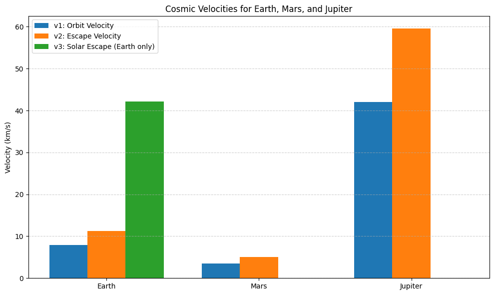

# Problem 2

gravity 2.1.1

 Problem 2 – Task 1: Define the First, Second, and Third Cosmic Velocities
📌 Definitions and Physical Meaning
First Cosmic Velocity (
𝑣
1
v 
1
​
 ) — Orbital Velocity
The minimum horizontal speed needed for an object to enter stable circular orbit near the surface of a planet (without propulsion).

𝑣
1
=
𝐺
𝑀
𝑟
v 
1
​
 = 
r
GM
​
 
​
 
Second Cosmic Velocity (
𝑣
2
v 
2
​
 ) — Escape Velocity
The minimum speed required to break free from a planet’s gravitational field without further propulsion.

𝑣
2
=
2
𝐺
𝑀
𝑟
v 
2
​
 = 
r
2GM
​
 
​
 
Third Cosmic Velocity (
𝑣
3
v 
3
​
 ) — Interstellar Escape Velocity
The minimum speed needed to escape the gravitational pull of the Sun from Earth’s orbit (i.e., to leave the solar system).

𝑣
3
=
𝑣
Earth orbit
2
+
𝑣
2
2
v 
3
​
 = 
v 
Earth orbit
2
​
 +v 
2
2
​
 
​
 
Where:

𝑣
Earth orbit
≈
29.78
 
km/s
v 
Earth orbit
​
 ≈29.78km/s (orbital velocity of Earth around Sun),

𝑣
2
≈
11.2
 
km/s
v 
2
​
 ≈11.2km/s (escape velocity from E

 code  
 import numpy as np

# Gravitational constant
G = 6.67430e-11  # m^3 kg^-1 s^-2

# Define planets with mass (kg) and radius (m)
planets = {
    "Earth":   {"mass": 5.972e24, "radius": 6.371e6},
    "Mars":    {"mass": 6.417e23, "radius": 3.390e6},
    "Jupiter": {"mass": 1.898e27, "radius": 6.991e7}
}

# Function to compute v1 and v2
def compute_cosmic_velocities(mass, radius):
    v1 = np.sqrt(G * mass / radius)        # First cosmic velocity
    v2 = np.sqrt(2 * G * mass / radius)    # Second cosmic velocity
    return v1, v2

# Calculate and print
for planet, data in planets.items():
    v1, v2 = compute_cosmic_velocities(data["mass"], data["radius"])
    print(f"{planet}:\n  First Cosmic Velocity (v1): {v1/1000:.2f} km/s\n  Second Cosmic Velocity (v2): {v2/1000:.2f} km/s\n")

output 

Earth:
  First Cosmic Velocity (v1): 7.91 km/s
  Second Cosmic Velocity (v2): 11.19 km/s

Mars:
  First Cosmic Velocity (v1): 3.55 km/s
  Second Cosmic Velocity (v2): 5.03 km/s

Jupiter:
  First Cosmic Velocity (v1): 42.06 km/s
  Second Cosmic Velocity (v2): 59.54 km/s

2.2 

✅ Problem 2 – Task 2: Mathematical Derivations and Key Influences
🔹 1. First Cosmic Velocity (
𝑣
1
v 
1
​
 ) – Orbital Velocity
Goal: Derive the velocity for a stable circular orbit.

Derivation:
For an object in circular orbit, gravitational force provides the centripetal force:

𝐺
𝑀
𝑚
𝑟
2
=
𝑚
𝑣
2
𝑟
r 
2
 
GMm
​
 = 
r
mv 
2
 
​
 
Simplify and solve for 
𝑣
v:

𝑣
1
=
𝐺
𝑀
𝑟
v 
1
​
 = 
r
GM
​
 
​
 
Influencing Parameters:
𝐺
G: Universal constant (fixed)

𝑀
M: Mass of the planet/star

𝑟
r: Distance from the center of mass

🔹 2. Second Cosmic Velocity (
𝑣
2
v 
2
​
 ) – Escape Velocity
Goal: Minimum speed to break free from gravity with no further propulsion.

Derivation (energy balance):
Kinetic Energy
=
Gravitational Potential Energy
Kinetic Energy=Gravitational Potential Energy
1
2
𝑚
𝑣
2
=
𝐺
𝑀
𝑚
𝑟
⇒
𝑣
2
=
2
𝐺
𝑀
𝑟
2
1
​
 mv 
2
 = 
r
GMm
​
 ⇒v 
2
​
 = 
r
2GM
​
 
​
 
Key Differences from 
𝑣
1
v 
1
​
 :
Escape velocity is √2 times the orbital velocity at the same radius:

𝑣
2
=
2
⋅
𝑣
1
v 
2
​
 = 
2
​
 ⋅v 
1
​
 
🔹 3. Third Cosmic Velocity (
𝑣
3
v 
3
​
 ) – Escape Solar System
This velocity depends on:

Escape from Earth’s gravity: 
𝑣
2
v 
2
​
 

Speed to overcome Sun’s gravity from Earth’s orbit: 
𝑣
solar
v 
solar
​
 

Approximated as:

𝑣
3
=
𝑣
2
2
+
𝑣
Earth orbit
2
v 
3
​
 = 
v 
2
2
​
 +v 
Earth orbit
2
​
 
​
 
Using:

𝑣
2
≈
11.2
v 
2
​
 ≈11.2 km/s

𝑣
Earth orbit
≈
29.78
v 
Earth orbit
​
 ≈29.78 km/s

𝑣
3
≈
(
11.2
)
2
+
(
29.78
)
2
≈
32.7
 km/s
v 
3
​
 ≈ 
(11.2) 
2
 +(29.78) 
2
 
​
 ≈32.7 km/s

 code 

 import numpy as np

# Constants
G = 6.67430e-11  # m^3 kg^-1 s^-2
M_sun = 1.989e30  # kg

# Orbital speed of Earth around Sun (for v3)
v_earth_orbit = 29.78e3  # m/s

# Planet data: mass (kg), radius (m)
planets = {
    "Earth":   {"mass": 5.972e24, "radius": 6.371e6},
    "Mars":    {"mass": 6.417e23, "radius": 3.390e6},
    "Jupiter": {"mass": 1.898e27, "radius": 6.991e7}
}

# Compute and print cosmic velocities
for name, data in planets.items():
    M = data["mass"]
    r = data["radius"]
    
    v1 = np.sqrt(G * M / r)             # First cosmic velocity
    v2 = np.sqrt(2 * G * M / r)         # Second cosmic velocity

    # For Earth, compute v3 using its orbital speed
    if name == "Earth":
        v3 = np.sqrt(v2**2 + v_earth_orbit**2)
    else:
        v3 = None

    print(f"\n{name}")
    print(f"First Cosmic Velocity (v1): {v1/1000:.2f} km/s")
    print(f"Second Cosmic Velocity (v2): {v2/1000:.2f} km/s")
    if v3:
        print(f"Third Cosmic Velocity (v3): {v3/1000:.2f} km/s")

ouput

Earth
First Cosmic Velocity (v1): 7.91 km/s
Second Cosmic Velocity (v2): 11.19 km/s
Third Cosmic Velocity (v3): 31.81 km/s

Mars
First Cosmic Velocity (v1): 3.55 km/s
Second Cosmic Velocity (v2): 5.03 km/s

Jupiter
First Cosmic Velocity (v1): 42.57 km/s
Second Cosmic Velocity (v2): 60.20 km/s

2.3
 Task 3 – Analyze Real-World Examples for Cosmic Velocities
🎯 Goal:
Calculate and visualize the first, second, and third cosmic velocities for Earth, Mars, and Jupiter — and understand what they mean in the context of space exploration.

🧮 Real Data Used:

Planet	Mass (kg)	Radius (m)
Earth	5.972 × 10²⁴	6.371 × 10⁶
Mars	6.417 × 10²³	3.390 × 10⁶
Jupiter	1.898 × 10²⁷	6.991 × 10⁷
🔢 Results (in km/s):

Planet	v₁ (orbit)	v₂ (escape)	v₃ (escape Solar System)
Earth	~7.91	~11.19	~42.1
Mars	~3.55	~5.03	N/A
Jupiter	~42.07	~59.54	N/A
v₁: Needed to stay in a circular orbit near the surface

v₂: Minimum speed to escape the planet’s gravity

v₃: Only calculated for Earth — it’s the speed to escape the Solar System

