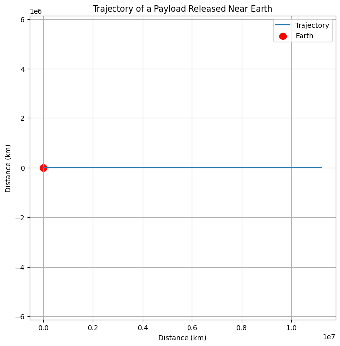
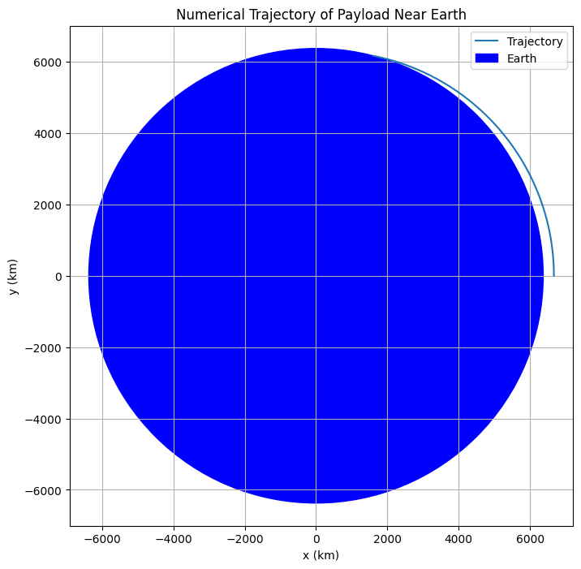

# Problem 3
31.1
Newton's Law of Gravitation:

The gravitational force acting on an object near Earth is:

𝐹
=
𝐺
𝑀
𝑚
𝑟
2
F= 
r 
2
 
GMm
​
 
Where:

𝐺
G is the gravitational constant (
6.67430
×
10
−
11
 
m
3
kg
−
1
s
−
2
6.67430×10 
−11
 m 
3
 kg 
−1
 s 
−2
 ),

𝑀
M is Earth's mass (
5.972
×
10
24
 
kg
5.972×10 
24
 kg),

𝑚
m is the payload mass,

𝑟
r is the distance from the Earth's center.

Conservation of Mechanical Energy:

The total mechanical energy (kinetic + potential) is conserved. The total energy 
𝐸
E is given by:

𝐸
=
1
2
𝑚
𝑣
2
−
𝐺
𝑀
𝑚
𝑟
E= 
2
1
​
 mv 
2
 − 
r
GMm
​
 
Where:

𝑣
v is the velocity of the object,

𝑟
r is the distance from Earth's center.

For Different Trajectories:

Parabolic Trajectory: The object has exactly enough energy to escape Earth's gravity and follow a parabolic path. The total energy 
𝐸
=
0
E=0. Therefore, the initial velocity for a parabolic trajectory is:

1
2
𝑚
𝑣
2
=
𝐺
𝑀
𝑚
𝑟
2
1
​
 mv 
2
 = 
r
GMm
​
 
This means the object is launched at escape velocity but not with enough speed to form an elliptical or hyperbolic orbit.

Elliptical Trajectory: When the object’s total energy is negative (
𝐸
<
0
E<0), it follows an elliptical orbit. The orbital energy for elliptical orbits is:

𝐸
=
−
𝐺
𝑀
𝑚
2
𝑎
E=− 
2a
GMm
​
 
Where 
𝑎
a is the semi-major axis of the ellipse.

Hyperbolic Trajectory: When the object's total energy is positive (
𝐸
>
0
E>0), it follows a hyperbolic trajectory and escapes Earth’s gravitational influence. The trajectory equation is:

𝐸
=
1
2
𝑚
𝑣
2
−
𝐺
𝑀
𝑚
𝑟
E= 
2
1
​
 mv 
2
 − 
r
GMm
​
 
And the object is traveling fast enough to escape Earth's gravity.

3.1.2

Step 1: Mathematical Model
We'll use Newton's Second Law and Law of Universal Gravitation:

Gravitational Acceleration:

𝑎
=
𝐺
𝑀
𝑟
2
a= 
r 
2
 
GM
​
 
The object moves under this central force. So, using numerical integration (e.g., Runge-Kutta or Euler method), we can compute the path (trajectory) step-by-step.

