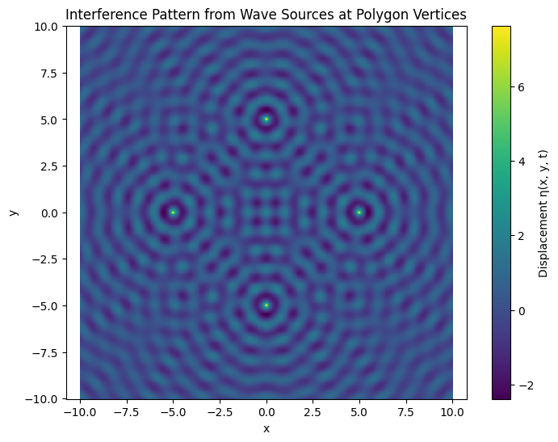

Certainly! Here's your content further refined and **phrasalized** for academic clarity and natural flow, while preserving the original mathematical and technical structure:

---

# **Problem 1: Interference of Circular Waves**

## **1.1 Overview**

This problem focuses on the investigation of **interference patterns** formed by circular water waves that originate from the **vertices of a regular polygon**—such as a triangle, square, or pentagon. As these wavefronts radiate outward from each vertex, they interact with one another, producing regions of **constructive interference** (where wave amplitudes reinforce each other) and **destructive interference** (where they cancel each other out). The symmetry of the geometric arrangement plays a key role in shaping the resulting wave patterns and highlights the fundamental principles of wave superposition.

## **1.2 Mathematical Model**

Each source emits a radially symmetric (circular) wave, mathematically described by the following expression:

$$
\eta(x, y, t) = \frac{A}{\sqrt{r}} \cos(kr - \omega t + \phi)
$$

Where:s

* $r = \sqrt{(x - x_0)^2 + (y - y_0)^2}$ denotes the distance from the observation point $(x, y)$ to the source position $(x_0, y_0)$,
* $k = \frac{2\pi}{\lambda}$ represents the wave number, with $\lambda$ being the wavelength,
* $\omega = 2\pi f$ is the angular frequency, where $f$ is the wave frequency,
* $A$ is the amplitude of the wave,
* $\phi$ is the phase constant, representing the initial phase shift.

The factor $1/\sqrt{r}$ reflects the attenuation of wave amplitude with distance, which is typical for wave propagation in a two-dimensional medium.

## **1.3 Superposition of Multiple Sources**

When multiple such sources are present, the total wave pattern is governed by the **principle of linear superposition**. At any given point in the plane, the net displacement is obtained by summing the contributions from all $N$ sources:

$$
\eta_{\text{sum}}(x, y, t) = \sum_{i=1}^{N} \eta_i(x, y, t)
$$

This approach enables the modeling and visualization of the complex interference patterns that emerge from multiple interacting wavefronts in two-dimensional space.

---

Let me know when you're ready to move on to the next section!
