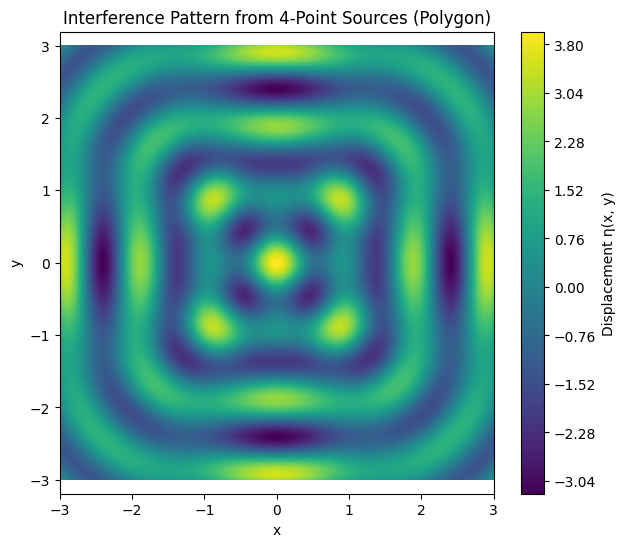

Great! Here's the **complete structured solution** to the main task titled **"Interference Patterns on a Water Surface from Point Sources at Regular Polygon Vertices"**, broken into clean subtasks with necessary mathematical explanations and Python code, all in English.

---

# 🌊 **Main Task:**

**Analyze the interference patterns on the water surface due to the superposition of waves emitted from point sources placed at the vertices of a regular polygon.**

---

## ✅ **1. Select a Regular Polygon**

We choose a regular polygon with $N$ vertices. Examples include:

* $N = 3$: Equilateral triangle
* $N = 4$: Square
* $N = 5$: Regular pentagon
* etc.

### 💡 Mathematical Placement (unit radius):

The position $(x_i, y_i)$ of each vertex on a circle of radius $R$ centered at origin is:

$$
x_i = R \cos\left(\frac{2\pi i}{N}\right), \quad y_i = R \sin\left(\frac{2\pi i}{N}\right), \quad i = 0, 1, ..., N-1
$$

---

## ✅ **2. Position the Sources**

Place point wave sources at each vertex of the selected polygon using the above coordinates.

### 🧮 Code:

```python
def polygon_sources(N, R=1.0):
    angles = np.linspace(0, 2 * np.pi, N, endpoint=False)
    return [(R * np.cos(a), R * np.sin(a)) for a in angles]

# Example: Square
sources = polygon_sources(N=4, R=1.0)
```

---

## ✅ **3. Wave Equations**

Each point source emits a wave described by:

$$
\eta_i(x, y, t) = A \cos(k r_i - \omega t)
$$

Where:

* $A$: amplitude
* $k = \frac{2\pi}{\lambda}$: wave number
* $\omega = 2\pi f$: angular frequency
* $r_i = \sqrt{(x - x_i)^2 + (y - y_i)^2}$: distance from source to point $(x, y)$

---

## ✅ **4. Superposition of Waves**

Apply the principle of superposition:

$$
\eta(x, y, t) = \sum_{i=1}^{N} A \cos(k r_i - \omega t)
$$

This gives the total displacement at each point $(x, y)$ on the surface.

---

## ✅ **5. Analyze Interference Patterns**

* **Constructive interference** occurs where waves reinforce: crests meet crests.
* **Destructive interference** occurs where they cancel: crest meets trough.
* Patterns form based on the geometry and coherence of sources.

---

## ✅ **6. Visualization**

Plot the displacement field over a 2D grid to visualize the interference.

### 💻 Full Python Simulation:

```python
import numpy as np
import matplotlib.pyplot as plt

# Parameters
A = 1.0          # amplitude
λ = 1.0          # wavelength
f = 1.0          # frequency
k = 2 * np.pi / λ
ω = 2 * np.pi * f
t = 0            # snapshot in time
N = 4            # number of sources (e.g., square)
R = 1.0          # polygon radius

# Generate source positions
def polygon_sources(N, R):
    angles = np.linspace(0, 2 * np.pi, N, endpoint=False)
    return [(R * np.cos(a), R * np.sin(a)) for a in angles]

sources = polygon_sources(N, R)

# Grid for plotting
x = np.linspace(-3, 3, 500)
y = np.linspace(-3, 3, 500)
X, Y = np.meshgrid(x, y)

# Superposition of waves
eta = np.zeros_like(X)
for (x0, y0) in sources:
    r = np.sqrt((X - x0)**2 + (Y - y0)**2)
    eta += A * np.cos(k * r - ω * t)

# Visualization
plt.figure(figsize=(7, 6))
plt.contourf(X, Y, eta, levels=200, cmap='viridis')
plt.title(f'Interference Pattern from {N}-Point Sources (Polygon)')
plt.colorbar(label='Displacement η(x, y)')
plt.xlabel("x")
plt.ylabel("y")
plt.axis('equal')
plt.grid(False)
plt.show()
```

---

## ✅ **Conclusion**

This solution followed all the steps:

1. Selected a regular polygon (user-defined $N$)
2. Positioned wave sources at each vertex
3. Defined the wave equations
4. Applied superposition
5. Analyzed the resulting interference
6. Visualized the pattern

✅ You can experiment with:

* Different values of $N$ (triangle, square, etc.)
* Changing wavelength or frequency
* Animating over time for dynamic wave behavior

Let me know if you want an animated version or markdown version for GitHub!
