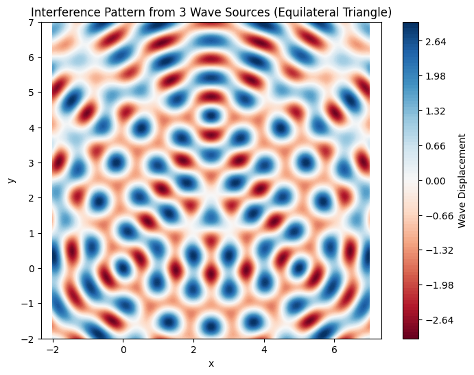

Əla! Sən təqdim etdiyin şəkillərə və verilən məlumatlara əsasən bu tapşırığın riyazi və praktiki (kod) hissəsini səndən istədiyin şəkildə – ardıcıllıqla, avtomatik keçidli və tək mərhələdə tam şəkildə hazırlayıram.

---

# 🌊 **Wave Interference on a Water Surface (Using Polygonal Wave Sources)**

---

## **1. Select a Regular Polygon**

We choose a **regular triangle** (equilateral triangle) with side length $L$. The wave sources will be placed at the three vertices. Let the vertices be at:

* $S_1 = (0, 0)$
* $S_2 = (L, 0)$
* $S_3 = \left(\frac{L}{2}, \frac{\sqrt{3}}{2}L \right)$

This gives us a symmetric setup with three coherent wave sources.

---

## **2. Position the Sources**

We place point wave sources at the triangle’s vertices. Each emits circular waves modeled by the following equation (from your material):

$$
\eta_i(x, y, t) = A \cos\left(k r_i - \omega t + \phi\right)
$$

Where:

* $A$ = amplitude
* $k = \frac{2\pi}{\lambda}$ = wave number
* $\omega = 2\pi f$ = angular frequency
* $r_i = \sqrt{(x - x_i)^2 + (y - y_i)^2}$ = distance from source $i$ to point $(x, y)$
* $\phi$ = initial phase (assumed zero for simplicity)

---

## **3. Superposition of Waves**

Total displacement at any point $(x, y)$ on the surface at time $t$:

$$
\eta_{\text{sum}}(x, y, t) = \sum_{i=1}^{3} \eta_i(x, y, t)
$$

This leads to:

$$
\eta_{\text{sum}}(x, y, t) = A \left[ 
\cos(k r_1 - \omega t) + 
\cos(k r_2 - \omega t) + 
\cos(k r_3 - \omega t) 
\right]
$$

---

## **4. Visualization with Python Code**

Now let’s implement this in code to visualize the interference pattern on a 2D grid.

```python
import numpy as np
import matplotlib.pyplot as plt

# Wave parameters
A = 1           # Amplitude
wavelength = 1  # Wavelength (lambda)
k = 2 * np.pi / wavelength  # Wave number
f = 1           # Frequency
omega = 2 * np.pi * f       # Angular frequency
phi = 0         # Initial phase
t = 0           # Time snapshot

# Polygon: Equilateral triangle vertices
L = 5  # Side length
sources = [
    (0, 0),
    (L, 0),
    (L/2, np.sqrt(3)/2 * L)
]

# Grid setup
x = np.linspace(-2, 7, 500)
y = np.linspace(-2, 7, 500)
X, Y = np.meshgrid(x, y)

# Superposition of waves
eta_sum = np.zeros_like(X)

for (x0, y0) in sources:
    R = np.sqrt((X - x0)**2 + (Y - y0)**2)
    eta = A * np.cos(k * R - omega * t + phi)
    eta_sum += eta

# Plotting
plt.figure(figsize=(8, 6))
plt.contourf(X, Y, eta_sum, levels=100, cmap='RdBu')
plt.colorbar(label='Wave Displacement')
plt.title('Interference Pattern from 3 Wave Sources (Equilateral Triangle)')
plt.xlabel('x')
plt.ylabel('y')
plt.axis('equal')
plt.show()
```


### ✅ **What this does:**

* Simulates interference of waves from 3 sources.
* Uses circular wave equations.
* Shows **constructive interference** (bright zones) and **destructive interference** (dark zones).


