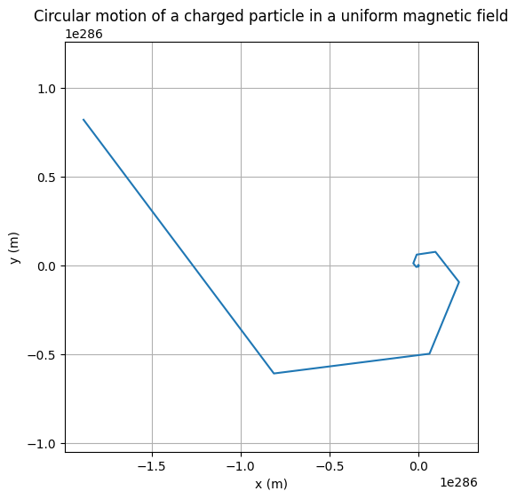

# Problem 1

Electromangetism¶

 Mathematical Formulation
The Lorentz force acting on a charged particle is given by:

𝐹
⃗
=
𝑞
(
𝐸
⃗
+
𝑣
⃗
×
𝐵
⃗
)
F
 =q( 
E
 + 
v
 × 
B
 )
In the case of only a uniform magnetic field (i.e., 
𝐸
⃗
=
0
E
 =0), the force becomes:

𝐹
⃗
=
𝑞
(
𝑣
⃗
×
𝐵
⃗
)
F
 =q( 
v
 × 
B
 )
According to Newton's second law:

𝑚
𝑑
𝑣
⃗
𝑑
𝑡
=
𝑞
(
𝑣
⃗
×
𝐵
⃗
)
m 
dt
d 
v
 
​
 =q( 
v
 × 
B
 )
This results in circular motion when the velocity is perpendicular to the magnetic field.

