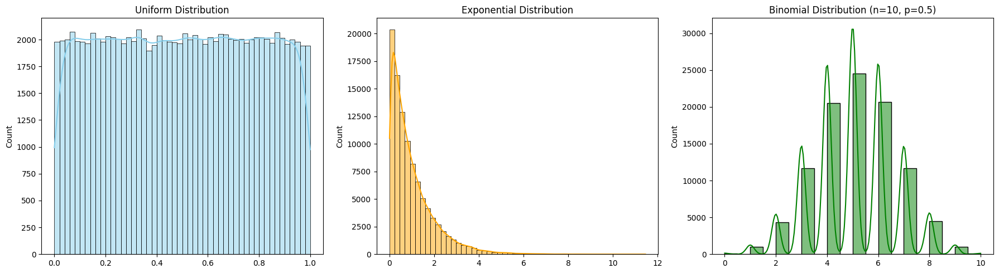
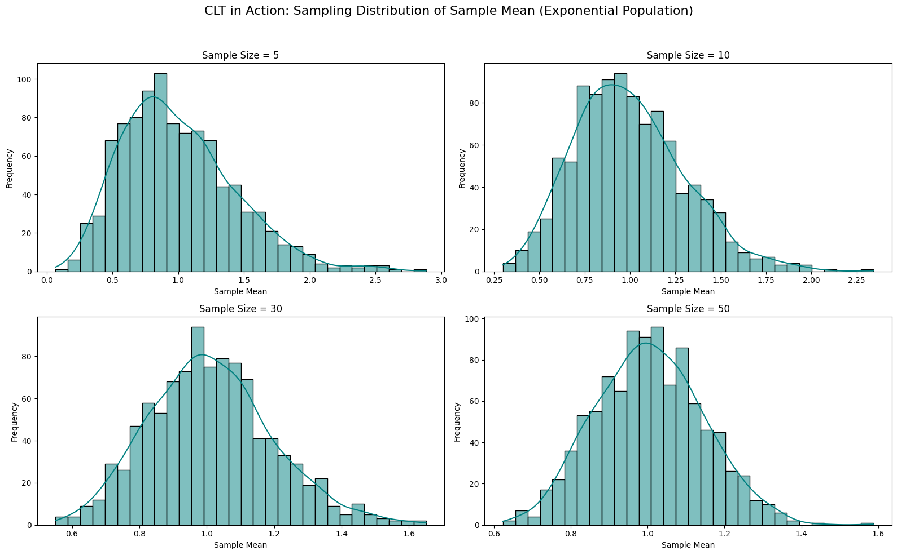

statitics

1.1 Mathematical Foundation (Population Distribution)
Let 
𝑋
X be a random variable drawn from a population distribution with:

Mean: 
𝜇
=
𝐸
[
𝑋
]
μ=E[X]

Variance: 
𝜎
2
=
Var
(
𝑋
)
σ 
2
 =Var(X)

We define the sample mean for a sample of size 
𝑛
n as:

𝑋
ˉ
𝑛
=
1
𝑛
∑
𝑖
=
1
𝑛
𝑋
𝑖
X
ˉ
  
n
​
 = 
n
1
​
  
i=1
∑
n
​
 X 
i
​
 
According to the Central Limit Theorem, as 
𝑛
→
∞
n→∞, the distribution of 
𝑋
ˉ
𝑛
X
ˉ
  
n
​
  tends toward:

𝑋
ˉ
𝑛
∼
𝑁
(
𝜇
,
𝜎
2
𝑛
)
X
ˉ
  
n
​
 ∼N(μ, 
n
σ 
2
 
​
 )

1.2
Mathematical Background
Given a population with mean 
𝜇
μ and variance 
𝜎
2
σ 
2
 , the sampling distribution of the sample mean for sample size 
𝑛
n is:

𝑋
ˉ
𝑛
=
1
𝑛
∑
𝑖
=
1
𝑛
𝑋
𝑖
∼
𝑁
(
𝜇
,
𝜎
2
𝑛
)
as 
𝑛
→
∞
X
ˉ
  
n
​
 = 
n
1
​
  
i=1
∑
n
​
 X 
i
​
 ∼N(μ, 
n
σ 
2
 
​
 )as n→∞
This means regardless of the original distribution, the distribution of sample means will tend to a normal distribution as sample size increases.

