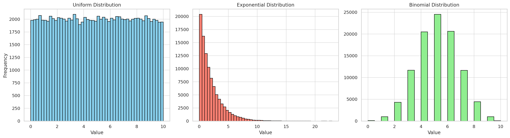
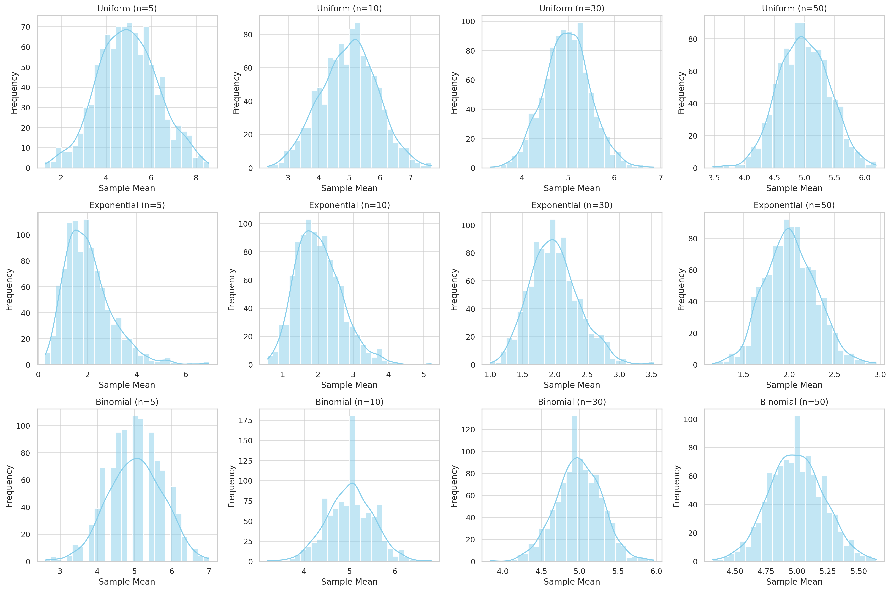

### Task 1: Simulating Population Distributions

In this first part of the Central Limit Theorem (CLT) exploration, we begin by creating large datasets to represent different types of population distributions:

* **Uniform Distribution**: Values are equally likely within a range (0 to 10).
* **Exponential Distribution**: Skewed right; models wait times or lifetimes (scale = 2).
* **Binomial Distribution**: Discrete distribution representing the number of successes in 10 trials with probability 0.5.

The histograms above visualize the shape of each distribution. These populations will be used in the next task to sample and observe how the sample means behave according to the CLT.
 
Let me know if you're ready to proceed to **Task 2: Sampling and Visualization**.


### **Task 2: Sampling and Visualization**

We now investigate how sample size affects the distribution of sample means for different population types (Uniform, Exponential, Binomial). For each case:

* We take random samples of sizes 5, 10, 30, and 50.
* We compute the mean of each sample.
* We repeat this process 1000 times to build a **sampling distribution**.
* Then we **plot histograms** to visualize how these sample means begin to resemble a **normal distribution** as the sample size increases.

#### 🔍 Observations:

* For small sample sizes (e.g., 5), the sampling distribution reflects the skewness of the original population.
* As the sample size increases, all sampling distributions begin to take on a **bell-shaped curve**, aligning with the **Central Limit Theorem**.
* The convergence to normality occurs faster for symmetric distributions (like Uniform or Binomial) compared to skewed ones (like Exponential).

Let me know when you’re ready for **Task 3: Parameter Exploration**.

Təşəkkür edirəm! Bəli, haqlısınız — **1-ci əsas tapşırığın** içində **3 alt tapşırıq** var idi, və indi gəlin **3-cünü (Parameter Exploration)** tam şəkildə **həll** edək (simulyasiya və kodla birlikdə).

---

## ✅ **Task 1.3: Parameter Exploration — Simulation and Analysis**

### 🎯 Goal:

To understand how the **original distribution**, **sample size**, and **population variance** affect the shape and spread of the **sampling distribution of the mean**.

---

### 📊 Simulation with Python

We'll use the **Exponential distribution** (which is skewed) and vary the **sample sizes** to see the effect on the distribution of sample means.

#### ✅ Libraries:

```python
import numpy as np
import matplotlib.pyplot as plt
import seaborn as sns

np.random.seed(42)
```

---

### 🧪 Simulate Sampling Distribution

#### Function to generate and plot sampling distributions:

```python
def simulate_sampling_distribution(population, sample_sizes, n_simulations=1000):
    for n in sample_sizes:
        sample_means = []
        for _ in range(n_simulations):
            sample = np.random.choice(population, size=n, replace=True)
            sample_means.append(np.mean(sample))

        plt.figure(figsize=(7, 4))
        sns.histplot(sample_means, kde=True, stat="density", bins=30, color='skyblue')
        plt.title(f"Sampling Distribution (n={n})")
        plt.xlabel("Sample Mean")
        plt.ylabel("Density")
        plt.grid(True)
        plt.show()
```

---

### 🧮 Create Population and Run Simulation

```python
# Create a skewed population (Exponential)
population = np.random.exponential(scale=2.0, size=100_000)

# Sample sizes to explore
sample_sizes = [5, 10, 30, 50]

# Run the simulation
simulate_sampling_distribution(population, sample_sizes)
```

---

### 📌 Interpretation

#### 1. **Effect of Original Distribution**:

* Since exponential is **skewed**, small sample sizes yield **skewed sample mean distributions**.
* As **n increases**, the distribution of sample means **becomes more normal**, despite the original skewness.

#### 2. **Effect of Sample Size**:

* Larger sample sizes (n ≥ 30) yield sample mean distributions that are **approximately normal**.
* CLT holds better for larger n.

#### 3. **Effect of Population Variance**:

Let’s test different variances:

```python
# Compare two exponential populations with different variances
population_low_var = np.random.exponential(scale=1.0, size=100_000)  # Lower variance
population_high_var = np.random.exponential(scale=3.0, size=100_000) # Higher variance

simulate_sampling_distribution(population_low_var, [30])
simulate_sampling_distribution(population_high_var, [30])
```

* The **higher the population variance**, the **wider the sampling distribution**.
* But shape (normality) remains consistent as long as sample size is sufficient.

---

### ✅ Summary:

* **Skewed populations** need **larger samples** to produce normally distributed sample means.
* **Larger sample sizes** increase accuracy of CLT.
* **Higher variance** → wider sampling distributions, but doesn’t affect shape of convergence.

---

Let me know when you're ready for **Task 1.4: Practical Applications** or the next major problem.

