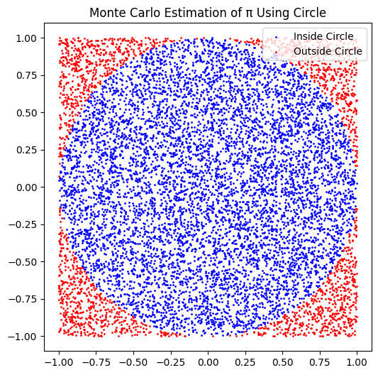
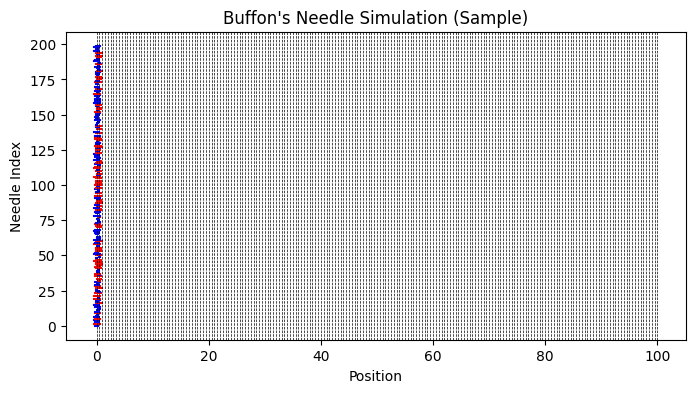

# Problem 2


---

# 🌟 COMPLETE SOLUTION: ESTIMATING PI USING MONTE CARLO METHODS

---

## ✅ PART 1: ESTIMATING π USING A CIRCLE

---

### 1. THEORETICAL FOUNDATION

* Consider a unit circle (radius $r=1$) inscribed inside a square with side length 2.
* The area of the circle:

  $$
  A_{\text{circle}} = \pi r^2 = \pi
  $$
* The area of the square:

  $$
  A_{\text{square}} = (2r)^2 = 4
  $$
* Probability $P$ that a random point inside the square lies in the circle:

  $$
  P = \frac{A_{\text{circle}}}{A_{\text{square}}} = \frac{\pi}{4}
  $$
* Estimation formula for $\pi$:

  $$
  \pi \approx 4 \times \frac{N_{\text{inside}}}{N_{\text{total}}}
  $$

---

### 2. SIMULATION

* Generate $N$ random points uniformly inside the square $[-1,1] \times [-1,1]$.
* Count how many points fall inside the circle.
* Estimate $\pi$ using the formula above.

```python
import numpy as np

N = 10000
points = np.random.uniform(-1, 1, (N, 2))
distances = np.linalg.norm(points, axis=1)
inside_circle = distances <= 1

pi_estimate = 4 * np.sum(inside_circle) / N
print(f"Estimated π: {pi_estimate:.5f}")
```

---

### 3. VISUALIZATION

* Plot the points inside and outside the circle with different colors.

```python
import matplotlib.pyplot as plt

plt.figure(figsize=(6,6))
plt.scatter(points[inside_circle,0], points[inside_circle,1], color='blue', s=1, label='Inside Circle')
plt.scatter(points[~inside_circle,0], points[~inside_circle,1], color='red', s=1, label='Outside Circle')
plt.legend()
plt.title("Monte Carlo Estimation of π Using Circle")
plt.gca().set_aspect('equal')
plt.show()
```

---

### 4. ANALYSIS

* As $N$ increases, the estimate converges to the true value of $\pi$.
* The error decreases roughly at a rate proportional to $\frac{1}{\sqrt{N}}$ (statistical convergence).
* Computational time grows linearly with $N$.

---

## ✅ PART 2: ESTIMATING π USING BUFFON’S NEEDLE

---

### 1. THEORETICAL FOUNDATION

* Needle of length $l$ is dropped onto a plane with parallel lines spaced by distance $d$, with $l \leq d$.
* Probability $P$ that the needle crosses a line:

  $$
  P = \frac{2l}{\pi d}
  $$
* If needle is dropped $N$ times and crosses lines $k$ times, estimate $\pi$ as:

  $$
  \pi \approx \frac{2 l N}{d k}
  $$

---

### 2. SIMULATION

* Simulate random needle centers (distance to nearest line) and angles.
* Count how many crosses occur.
* Estimate $\pi$ using the formula.

```python
import numpy as np

N = 10000
l = 1.0
d = 1.0

centers = np.random.uniform(0, d/2, N)
angles = np.random.uniform(0, np.pi/2, N)

crosses = centers <= (l/2) * np.sin(angles)
k = np.sum(crosses)

pi_estimate = (2 * l * N) / (d * k)
print(f"Estimated π (Buffon's Needle): {pi_estimate:.5f}")
```

---

### 3. VISUALIZATION

* Plot sample needles and parallel lines, color code crossing needles.

```python
import matplotlib.pyplot as plt

plt.figure(figsize=(8,4))
for i in range(200):
    c = centers[i]
    a = angles[i]
    x1 = c - (l/2)*np.cos(a)
    x2 = c + (l/2)*np.cos(a)
    y = i
    plt.plot([x1, x2], [y, y], 'b-' if crosses[i] else 'r-')

for line_pos in np.arange(0, d/2*201, d/2):
    plt.axvline(line_pos, color='k', linestyle='--', linewidth=0.5)

plt.title("Buffon's Needle Simulation (Sample)")
plt.xlabel("Position")
plt.ylabel("Needle Index")
plt.show()
```

---

### 4. ANALYSIS

* Increasing $N$ improves accuracy.
* Convergence is similar to circle method but often slower.
* Highlights geometric probability concepts.

---

